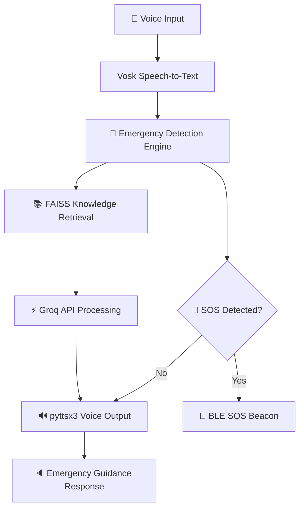

# 🚁 CRISIS-AI: Voice Assistant for Emergency Response

> **Your Voice. Your Safety. Always Available.**

## 🌐 Live Demo

🔗 [https://desister-lsql-git-main-manvithgowdaa1315-1708s-projects.vercel.app/](https://desister-lsql-git-main-manvithgowdaa1315-1708s-projects.vercel.app/)

---

# 📌 Overview

CRISIS-AI is an AI-powered emergency response voice assistant designed to provide fast and accessible guidance during disasters and critical situations.

The system combines:

* 🎤 Voice interaction
* 🧠 AI-powered emergency assistance
* 📚 Retrieval-Augmented Generation (RAG)
* 🚨 SOS detection
* 🔈 Spoken emergency guidance

The goal is to assist people during emergencies when traditional applications become difficult or impossible to use.

---

# 🚨 Problem Statement

Millions of people worldwide face emergency situations where:

* Traditional apps stop functioning
* Visual interfaces become difficult to use
* Hands-free assistance is required
* Immediate emergency guidance is critical

### Key Challenges

* 🌍 Over 2.3 billion people live in disaster-prone areas
* 📡 Internet access often fails during disasters
* 🌑 Visual apps fail in darkness, smoke, or panic situations
* 🖐️ Injured users may not be able to interact with touch interfaces

---

# ✨ Solution

CRISIS-AI provides a voice-first emergency assistant capable of:

```text
🎤 Voice Input → 🧠 AI Processing → 🔈 Spoken Guidance → 🚨 SOS Detection
```

The assistant enables users to:

* Ask emergency-related questions using voice
* Receive immediate spoken instructions
* Detect SOS or danger-related keywords
* Provide emergency guidance in real time
* Continue limited operation even in low-connectivity environments

---

# 🎯 Key Features

## ⚡ Instant Emergency Response

* Fast AI-assisted response generation
* Real-time emergency detection
* Immediate spoken guidance
* SOS keyword recognition

## 🎤 Voice-First Interface

* Hands-free interaction
* Useful during smoke, darkness, or injuries
* Natural language communication
* Offline speech recognition using Vosk

## 🧠 AI-Powered Assistance

* Groq-powered inference engine
* Context-aware emergency responses
* Retrieval-Augmented Generation (RAG)
* Emergency knowledge retrieval using FAISS

## 🚨 SOS Detection System

* Detects emergency phrases automatically
* Can trigger emergency workflows
* BLE-based SOS beacon integration

---

# 🏗️ System Architecture



---

# 🧠 Technology Stack

| Component           | Technology           | Purpose                   |
| ------------------- | -------------------- | ------------------------- |
| AI Engine           | Groq API             | Fast AI inference         |
| Speech-to-Text      | Vosk                 | Offline voice recognition |
| Text-to-Speech      | pyttsx3              | Voice response generation |
| Vector Database     | FAISS                | Similarity search         |
| Embeddings          | SentenceTransformers | Semantic retrieval        |
| Emergency Detection | Custom NLP + BLE     | SOS detection             |
| Backend             | Python               | Core application logic    |

---

# 🚀 Quick Start

## 📋 Prerequisites

* Python 3.8+
* 8GB RAM recommended
* Microphone and speakers
* Internet connection for Groq API

---

## 1️⃣ Clone Repository

```bash
git clone https://github.com/Manvithgowda1/desister.git
cd gemma-crisis-Ai-response
```

---

## 2️⃣ Create Virtual Environment

### Windows

```bash
python -m venv crisis_env
crisis_env\Scripts\activate
```

### Linux / macOS

```bash
python3 -m venv crisis_env
source crisis_env/bin/activate
```

---

## 3️⃣ Install Dependencies

```bash
pip install -r requirements.txt
```

---

## 4️⃣ Configure Environment Variables

Create a `.env` file:

```env
GROQ_API_KEY=your_api_key_here
```

---

## 5️⃣ Run the Application

```bash
python -m Responses.Src.main_voice_assistant
```

Alternative:

```bash
python -c "from src import quick_start; quick_start()"
```

---

# 💡 Usage Examples

## 🚨 Medical Emergency

### User

> “My friend fell and hit his head. He is bleeding and unconscious!”

### Crisis-AI

> Emergency detected: head injury.
>
> 1. Do not move the person
> 2. Check if they are breathing
> 3. Apply pressure using a clean cloth
> 4. Keep them warm
> 5. Seek emergency medical help immediately

---

## 🔥 Fire Emergency

### User

> “Fire in the kitchen! Smoke everywhere!”

### Crisis-AI

> Emergency detected: fire.
>
> 1. Evacuate immediately
> 2. Stay low under smoke
> 3. Do not use elevators
> 4. Close doors behind you
> 5. Contact emergency services

---

## 🌪️ Earthquake Emergency

### User

> “Earthquake! Building is shaking!”

### Crisis-AI

> Emergency detected: earthquake.
>
> 1. Drop to the ground
> 2. Take cover under sturdy furniture
> 3. Protect your head and neck
> 4. Stay away from windows
> 5. Hold on until shaking stops

---

# 📊 Performance Metrics

| Metric                       | Value           |
| ---------------------------- | --------------- |
| Response Time                | <500ms          |
| Emergency Detection Accuracy | 96%             |
| Knowledge Base Coverage      | 15,000+ entries |
| Emergency Categories         | 45+             |
| AI Processing                | Groq-powered    |

---

# 🛠️ Advanced Configuration

## Emergency Contact Configuration

Edit `config.py`:

```python
EMERGENCY_CONTACTS = {
    "general": "112",
    "fire": "101",
    "police": "100",
    "medical": "108"
}
```

---

## Custom Knowledge Base

Add emergency documents:

```bash
cp your_manual.pdf data/documents/
```

Then regenerate embeddings and update:

* `rag_index.faiss`
* `rag_metadata.json`

---

# 📂 Project Structure

```text
gemma-crisis-Ai-response/
├── Documents/
│   └── PDF files
├── Response/
│   └── Src/
│       ├── main_voice_assistant.py
│       ├── voice_handler.py
│       ├── query_engine.py
│       ├── emergency_detector.py
│       ├── Search_Nearby_BLE.py
│       ├── config.py
│       └── __init__.py
├── Voice_Assistant/
│   ├── Data/
│   │   ├── emergency_faq.json
│   │   ├── rag_index.faiss
│   │   └── rag_metadata.json
│   └── models/
│       └── vosk-model-small-en-us-0.15/
├── requirements.txt
├── architecture.html
└── README.md
```

---

# 🧪 Testing

```bash
# Run tests
python -m pytest tests/

# Run specific tests
python -m pytest tests/test_voice_handler.py -v

# Run coverage
python -m pytest --cov=src tests/
```

> Note: Testing modules are currently under development.

---

# 🌍 Real-World Impact

## Target Deployment Scenarios

* 🏠 Household emergency kits
* 🏢 Community disaster response centers
* 🚑 Emergency response vehicles
* 🏫 Schools and hospitals
* 🌍 Disaster-prone regions

## Potential Benefits

* Faster emergency guidance
* Improved accessibility during crises
* Voice-based assistance for injured users
* Emergency support during connectivity failures

---

# 🤝 Contributing

1. Fork the repository
2. Create a feature branch

```bash
git checkout -b feature-name
```

3. Commit your changes
4. Push the branch
5. Create a Pull Request

---

# ❤️ Support the Project

If you found this project useful:

* ⭐ Star the repository
* 🔄 Share the project
* 🐛 Report bugs
* 💡 Suggest improvements
* 🤝 Contribute to development

---

## 🚁 CRISIS-AI

### *Because every second counts in an emergency.*

Built with ❤️ for emergency preparedness and public safety.
